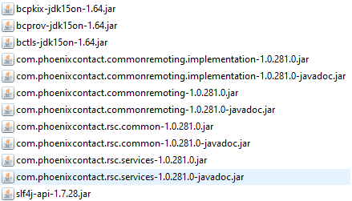

# PLCnext Technology - Java RSC Demo

## Introduction

This project is a GUI showcasing some of the functionalities exposed by PLCnext controllers, that can be used remotely. This is a simple eclipse project which can be interpreted by most Java IDEs. The only prerequisite is that you have a JDK java 10 or higher. Maybe the most useful feature of this app besides it´s demonstrational value is the ability to monitor and write to Global Data Space Variables on the PLC without using PLCnext Engineer. In case you want to read more about the functionality provided by this application, you can read the [community article](https://www.plcnext-community.net/en/hn-makers-blog/423-how-to-use-the-rsc-services-out-of-a-remote-java-application.html).

## Getting Started

To get this project running, clone this repository into a folder on your local machine and download the [PLCnext Java RSC API](https://www.phoenixcontact.com/qr/2404267/softw). The libraries in that package need to be placed into the libs folder like in the picture.

Then Import the project into your Java IDE, build and run the application.
If you want to configure default credentials for the login screen, you can edit the config.txt file under src/main/resources.

If you need some more instructions on how to use this applications you might want to have a look at the community article linked above.

## Feedback

* Ask a question in our [Forum](https://www.plcnext-community.net/index.php?option=com_easydiscuss&view=categories&Itemid=221&lang=en).
* File a bug in [GitHub Issues](https://github.com/PLCnext/JavaRSC_Example/issues).

## License

Copyright (c) Phoenix Contact Gmbh & Co KG. All rights reserved.

Licensed under the [MIT](LICENSE) License.
